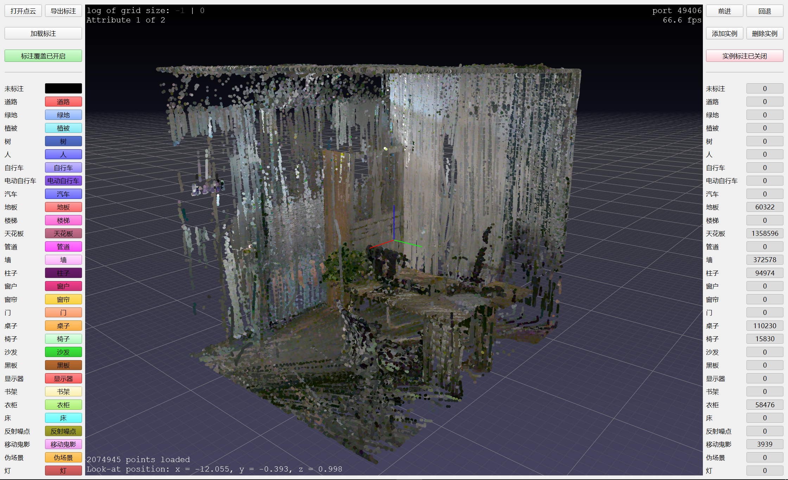
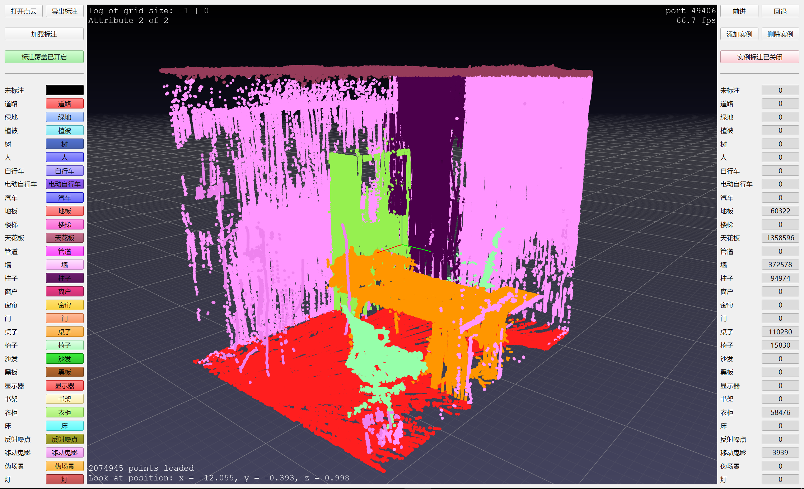
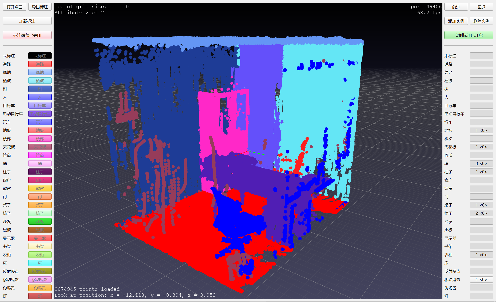

# PCAT

该项目是一个基于pptk和PyQt5开发的点云标注工具。它提供了一个用户友好的界面，让用户能够使用自定义的标签对点云数据进行标注操作。

## 项目简介

基于以下工具开发

- [pptk](https://github.com/heremaps/pptk)
- [PyQt5](https://www.riverbankcomputing.com/software/pyqt/)

## 环境要求

- Python 3.7
- Windows 10操作系统

请注意，由于项目依赖于 `pywin32` 库，因此无法直接在Linux等其他操作系统环境中运行。

## 开始使用

clone 项目

```bash
git clone https://github.com/crayonsea/PCAT.git
```

安装项目依赖项

```bash
conda create -n pcatenv python=3.7
conda activate pcatenv
pip install -r requirements.txt
```

运行项目

```bash
cd PCAT
python pcat.py
```

## 使用方式

### 鼠标按键

- 视角操作：相机的观察位置由红绿蓝光标表示，其中各段对应 x、y 和 z 轴。执行鼠标左键拖动以以转盘方式旋转视角。同时按住 Shift 键时，执行鼠标左键拖动以平移视角。双击鼠标左键将观察位置移动到靠近鼠标光标的点上。滚轮调整缩放。
- 点选择。在鼠标左键拖动框选时，按住Ctrl/Ctrl-Shift键可以将点添加到/从当前选择中移除。在鼠标左键点击点时，按住Ctrl/Ctrl-Shift键可以将单个点添加到/从当前选择中移除。点击鼠标右键可以清除当前选择。

### 快捷键

- 观察角度切换：`q`, `w`, `e`, `a`, `s`, `d`
- 投影方式切换：`r`
- 调整点云点大小：`-`, `+`
- 切换可视化属性（RGB 或 Label）：`[`, `]`
- 居中当前点云：`c`
- 切换覆盖/非覆盖标注：`z`
- 调整缩放：`<`, `>`

## 运行效果

输入场景



语义类别标注



实例类别标注。在标好语义标签之后，可以对每个语义类别进行实例标注。



## 更多配置

### 自定义标签类别

修改 `label.json`，可以自定义标签名称，标签可视化颜色，标签编号。

### 自定义数据类型

修改 `file_utils.py`，可以自定义加载数据，加载标签，导出标签。
